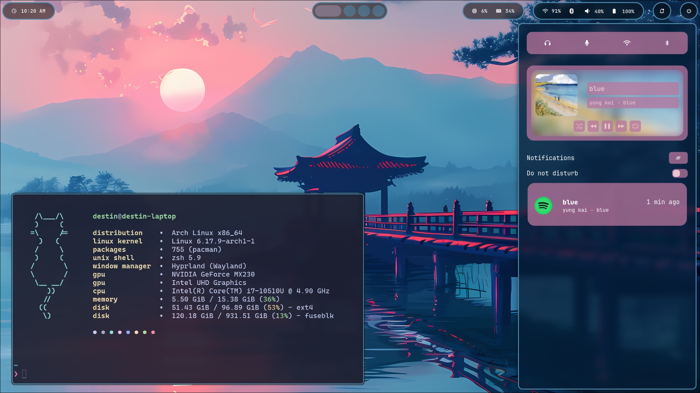

# Dotfiles

This is my dotfiles configuration, feel free to use them however you want.



## Recommended Utilities

- [Bat](https://github.com/sharkdp/bat?tab=readme-ov-file#installation)
- [Exa](https://github.com/ogham/exa?tab=readme-ov-file#installation)
- [Fzf](https://github.com/junegunn/fzf?tab=readme-ov-file#installation)
- [Zoxide](https://github.com/ajeetdsouza/zoxide?tab=readme-ov-file#installation)
- [Ripgrep](https://github.com/BurntSushi/ripgrep?tab=readme-ov-file#installation)

## Installation

Clone this repository to your home directory:

```sh
git clone --depth 1 https://github.com/DestinEcarma/dotfiles.git ~/.dotfiles
```

Run the bootstrap script to create symlinks for all configurations:

```sh
~/.dotfiles/bootstrap
```
