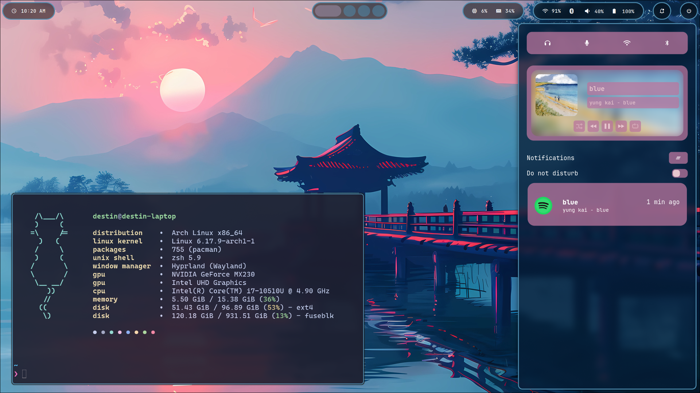
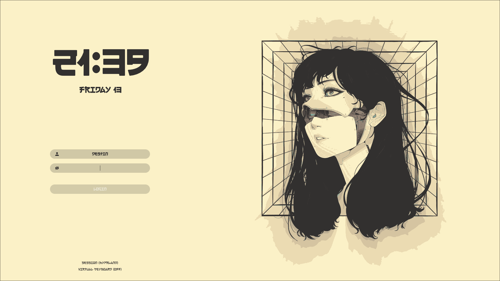

# Dotfiles

My personal Linux dotfiles and desktop configuration.

> **Note:** These configurations are tailored to my workflow, primarily using Hyprland on Arch Linux. Feel free to use or adapt them, but review the files before running the bootstrap script.



## Included Configurations

The repository contains configuration files for my terminal, window manager, editor, status bar, notifications, and other desktop utilities.

See [`config/README.md`](./config/README.md) for the complete list of configuration dependencies.

## Recommended Utilities

The following command-line tools are used by my `zsh` configuration:

- [bat](https://github.com/sharkdp/bat)
- [eza](https://github.com/eza-community/eza)
- [fzf](https://github.com/junegunn/fzf)
- [zoxide](https://github.com/ajeetdsouza/zoxide)
- [ripgrep](https://github.com/BurntSushi/ripgrep)

## SDDM Theme

My login screen uses the [SDDM Astronaut Theme](https://github.com/Keyitdev/sddm-astronaut-theme).



## Installation

Clone the repository into your home directory:

```sh
git clone --depth 1 https://github.com/DestinEcarma/dotfiles.git ~/.dotfiles
```

Review the repository and bootstrap script before continuing:

```sh
cd ~/.dotfiles
```

Run the bootstrap script to create symbolic links for the configurations:

```sh
./bootstrap
```
